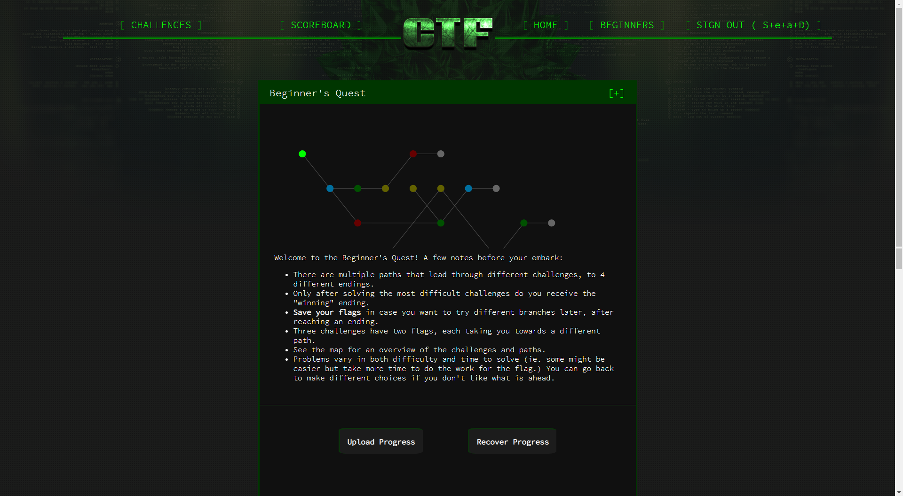
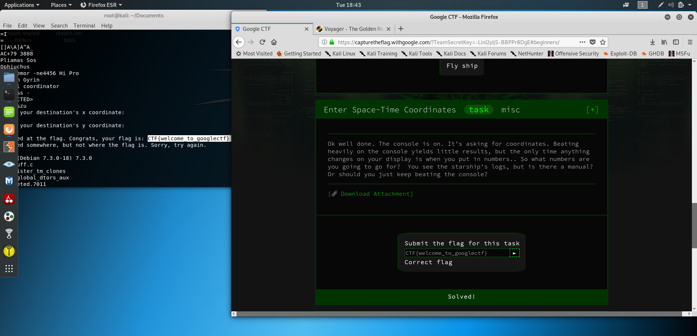
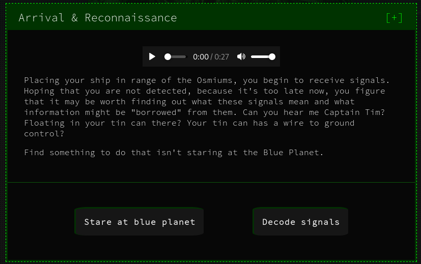

## Google CTF 2019

Google CTF 2019: Google runs a CTF competition in two rounds: an online qualification round and an onsite final round. The top 10 teams from the qualification round will be invited to the finals to compete onsite for a prize pool of more than USD $31,337. In addition to the grand prizes, some of the best and creative write-ups that we receive during the qualifying round will be rewarded as well. We want to give you an opportunity to share with the world the clever ways you solve challenges. You can read more about the Google CTF here.

URL: https://capturetheflag.withgoogle.com/



# Beginner's Quests - Enter Space-Time Coordinates
```
Ok well done. The console is on. It's asking for coordinates. Beating heavily on the console yields little results, but the only time anything changes on your display is when you put in numbers.. So what numbers are you going to go for? You see the starship's logs, but is there a manual? Or should you just keep beating the console?
```
We are provided with a text file and a binary. I had no idea, i didn't run the binary but instead get all the strings inside it:

> strings rand2

and i got:

> CTF{welcome_to_googlectf}



# Beginner's Quests - Arrival & Reconnaissance

```
Placing your ship in range of the Osmiums, you begin to receive signals. Hoping that you are not detected, because it's too late now, you figure that it may be worth finding out what these signals mean and what information might be "borrowed" from them. Can you hear me Captain Tim? Floating in your tin can there? Your tin can has a wire to ground control?

Find something to do that isn't staring at the Blue Planet.
```


We are provided with an attachment.

**Recon:** 

Download an atachment and open it as PDF, we can see the `osmium` word written on the spaceship. So it's will be something useful later. Now try to run the program, it will ask for the satellite name, let's try `osmium`.

```
Enter the name of the satellite to connect to or 'exit' to quit
osmium
Establishing secure connection to osmium
 satellite...
Welcome. Enter (a) to display config data, (b) to erase all data or (c) to disconnect
a
Username: brewtoot password: ********************       166.00 IS-19 2019/05/09 00:00:00        Swath 640km     Revisit capacity twice daily, anywhere Resolution panchromatic: 30cm multispectral: 1.2m        Daily acquisition capacity: 220,000km²  Remaining config data written to: https://docs.google.com/document/d/14eYPluD_pi3824GAFanS29tWdTcKxP_XUxx7e303-3E
```

Open the Google Doc above we get the MD5:

`VXNlcm5hbWU6IHdpcmVzaGFyay1yb2NrcwpQYXNzd29yZDogc3RhcnQtc25pZmZpbmchCg==`

Decode it and we get:

```
root@kali xxxxxxxx#: echo TG9naW5zIGZvciBob21lIGFuZCB3b3JrIGNvbXB1dGVyOgpVc2VybmFtZTogd2Vib3J0dG8KUGFzc3dvcmQ6IHRvdGFsbHktbm90LWEtZmxhZy1rZWVwLXNuaWZmaW5nCg== | base64 -d
Logins for home and work computer:
Username: webortto
Password: totally-not-a-flag-keep-sniffing
```

So yea let's sniff it with wireshark


We can get the flag from the traffic: `CTF{4efcc72090af28fd33a2118985541f92e793477f}`

**Tricks:**
 
 I learn this commands from another user's solution which is very useful with wireshark:

```console
root@kali:/media/sf_CTFs/google/Satellite# tshark -nr osmium.pcapng  -Y 'frame contains "password"'
   16 28.632225193 34.76.101.29 → 10.0.2.15    TCP 417 1337 → 52616 [PSH, ACK] Seq=88 Ack=3 Win=65535 Len=363 1337 52616
root@kali:/media/sf_CTFs/google/Satellite# tshark -nr osmium.pcapng  -Y 'frame contains "password"' -T fields -e data.text -o data.show_as_text:TRUE
Username: brewtoot password: CTF{4efcc72090af28fd33a2118985541f92e793477f}      166.00 IS-19 2019/05/09 00:00:00       Swath 640km      Revisit capacity twice daily, anywhere Resolution panchromatic: 30cm multispectral: 1.2m        Daily acquisition capacity: 220,000km Remaining config data written to: https://docs.google.com/document/d/14eYPluD_pi3824GAFanS29tWdTcKxP_XUxx7e303-3E
```

