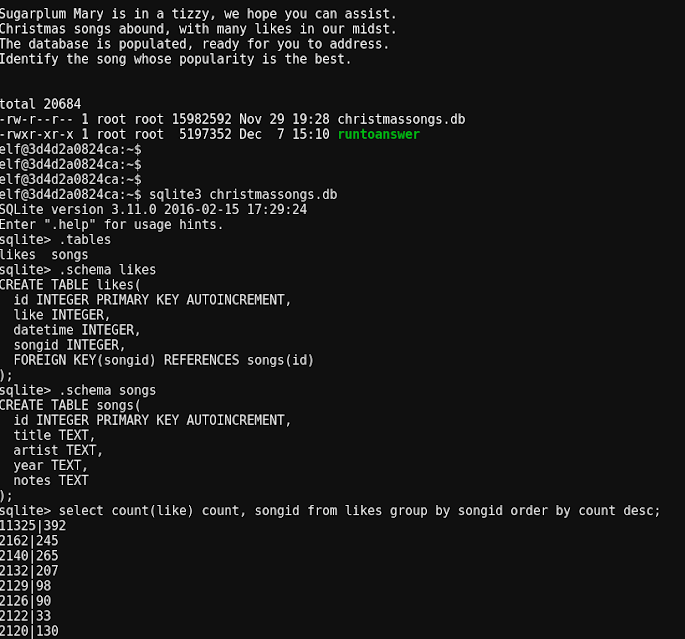

# Cranberry Pis

----
## 1. Orientation Challenge

- Need to find the "real" `find` command

## 2. Cryokinetic Magic / Holly Evergreen

- Call the file with `ld-linux.so2` command.

## 3. There's Snow Place Like Home / Pepper Minstix

- Use the `qemu-arm` tool

## 4. Cliffs of Winsanity / Sparkle RedBerry

- Just need to kill a process as below

## 5. Bumbles Bounce / Minty CandyCane

- Need to find the least common browser user-agent

## 6. I Don’t Think We’re In Kansas Anymore / Sugarplum Mary

- Most like song query as below

## 7. Oh Wait! Maybe We Are… / Shinny Upatree

- Restore a shadow file

## 8. We’re Off To See The / Wunorse Openslae

- Hijack the command using `LD_Preload`

# The Story Questions

(TBD)
