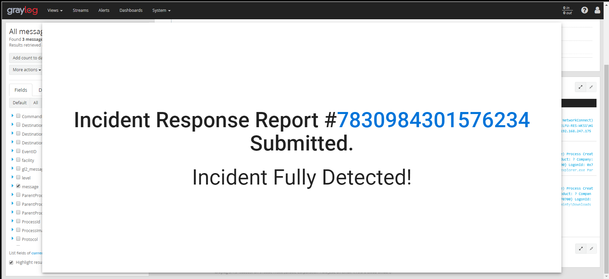

# Kringlecon 2019

I participated in this but haven't done a lot as I i didn't have much time.

----
## List of Challenge
1. Escape Ed
2. Frosty Keypad
3. Graylog

----
## 1. Escape Ed

```
                  ........................................
               .;oooooooooooool;,,,,,,,,:loooooooooooooll:
             .:oooooooooooooc;,,,,,,,,:ooooooooooooollooo:
           .';;;;;;;;;;;;;;,''''''''';;;;;;;;;;;;;,;ooooo:
         .''''''''''''''''''''''''''''''''''''''''';ooooo:
       ;oooooooooooool;''''''',:loooooooooooolc;',,;ooooo:
    .:oooooooooooooc;',,,,,,,:ooooooooooooolccoc,,,;ooooo:
  .cooooooooooooo:,''''''',:ooooooooooooolcloooc,,,;ooooo,
  coooooooooooooo,,,,,,,,,;ooooooooooooooloooooc,,,;ooo,
  coooooooooooooo,,,,,,,,,;ooooooooooooooloooooc,,,;l'
  coooooooooooooo,,,,,,,,,;ooooooooooooooloooooc,,..
  coooooooooooooo,,,,,,,,,;ooooooooooooooloooooc.
  coooooooooooooo,,,,,,,,,;ooooooooooooooloooo:.
  coooooooooooooo,,,,,,,,,;ooooooooooooooloo;
  :llllllllllllll,'''''''';llllllllllllllc,


Oh, many UNIX tools grow old, but this one's showing gray.
That Pepper LOLs and rolls her eyes, sends mocking looks my way.
I need to exit, run - get out! - and celebrate the yule.
Your challenge is to help this elf escape this blasted tool.

-Bushy Evergreen

Exit ed.

1100
```

Try to play around with the editor and somehow i hit Q just to exit...

## 2. Frosty Keypad

```
Hey kid, it's me, Tangle Coalbox. I'm sleuthing again, and I could use your help. Ya see, this here number lock's been popped by someone. I think I know who, but it'd sure be great if you could open this up for me. I've got a few clues for you.

One digit is repeated once.
The code is a prime number.
You can probably tell by looking at the keypad which buttons are used.
```

- So, prime numbers
- Look at the console we can see the 1, 3, 7 were being pressed
- Try bruteforcing, the number should be 7331

## 3. Graylog

```
It's me - Pepper Minstix. Normally I'm jollier, but this Graylog has me a bit mystified. Have you used Graylog before? It is a log management system based on Elasticsearch, MongoDB, and Scala. Some Elf U computers were hacked, and I've been tasked with performing incident response. Can you help me fill out the incident response report using our instance of Graylog? It's probably helpful if you know a few things about Graylog. Event IDs and Sysmon are important too. Have you spent time with those? Don't worry - I'm sure you can figure this all out for me! Click on the All messages Link to access the Graylog search interface! Make sure you are searching in all messages! The Elf U Graylog server has an integrated incident response reporting system. Just mouse-over the box in the lower-right corner. Login with the username elfustudent and password elfustudent.
```

- This problem requires a little bit of reading from the manual here: http://docs.graylog.org/en/3.1/pages/queries.html
- There are 10 questions, and these are the search filters and hints:

C1 - Minty CandyCane reported some weird activity on his computer after he clicked on a link in Firefox for a cookie recipe and downloaded a file. What is the full-path + filename of the first malicious file downloaded by Minty?
Answer: `C:\Users\minty\Downloads\cookie_recipe.exe`
Hint: `TargetFilename:/.+cookie.+recipe.+/`

C2 - The malicious file downloaded and executed by Minty gave the attacker remote access to his machine. What was the ip:port the malicious file connected to first?
Answer: `192.168.247.175:4444`
Hint: `ProcessImage:/.+cookie_recipe.exe/`

C3 - What was the first command executed by the attacker?
Answer: `whoami`
hint: `ParentProcessImage:/.+cookie_recipe.+/`

