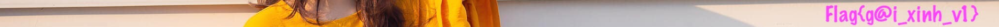

## Viblo CTF 2019


# Not So Equal

Upon visiting the site, you can see the code as:

```php
<!DOCTYPE HTML>
<?php
require("flag.php");

if (isset($_GET['source'])) {
  highlight_file(__FILE__);
  die();
}

if (isset($_GET['magic_command'])) {

  $what_he_said = $_GET['magic_command'];
  $what_you_dont_want_to_hear = 'HomNayOT_EmNhe';
  $what_you_actually_heard = preg_replace(
    "/$what_you_dont_want_to_hear/",
    '',
    $what_he_said
  );


  if ($what_you_actually_heard === $what_you_dont_want_to_hear) {
    poor_you();
  }
}
?>
```

If you notice, whatever you type in `?magic_command=` will be matched with a regex. Our goal is to have the string to be equal to `HomNayOT_EmNhe`. It can be easily done by insert the a same string inside itself to bypass the check. 

```
http://172.104.49.143:1318/?magic_command=HomNaHomNayOT_EmNheyOT_EmNhe`
```

The flag is:

`Flag{V4ng_4nh_cu0c_s0ng_m4}`

# Web11

The image will alter after a second, its easy to just save the image and the inspect the frame.



`Flag{g@i_xinh_v1}`

# Stragic pHp

Viewing the soure code will reveal the file `index.phps`. Upon inspecting the file we have:

```php
<?php
    $value = isset($_POST['value']) ? $_POST['value'] : '';
    $key = "CENSORED";
    $flag = ($value !== "" && !strcmp($value, $key)) ? 'CENSORED': 'bad key';
?>
```

Okay the very basic thing when we see strcmp is to send an array as arguement. For that, instead of sending `value=` in crafing my payload with `values[]=`. And here is our flag:

`Flag{dont_trust_strcmp_at_all}`

321815130f0c44062b1d072b07441911001c451a4d09

# XOR easy

I usually use this page to decrypt/encrypt xor message: https://www.dcode.fr/xor-cipher

Putting in the code, we got the flag:

`Flag{x0r_is_s0meth1n9}`

# Do you love cat

By viewing of the the page's source, i could see the file listed in `secret\todo.md`. Navigating to the file, we learn a clue about `robot.txt`:

```
# http://www.robotstxt.org/

User-agent: *

Allow: index.html
# be patient
# Add pages under construction to start indexing them.
Allow: cats-best.html
Allow: cats-cute.html
Allow: cats-fat.html
Allow: cats-and-mouse.html

# Hide old versions.
Disallow: /index-last.html
Disallow: /index-very-last.html

# Hide dev. stuff.
Disallow: /README.md
Disallow: /LICENSE
Disallow: /src/assets/stylesheets/*.scss

# Hide blast from the past.
Disallow: /index-old.html
Disallow: /old/index.html

# I don't want bots to index my private stuff.
Disallow: /secret/notes.md
Disallow: /secret/secret.md
Disallow: /secret/todo.md
Disallow: /secret/journal.md
Disallow: /secret/javascript.html
```

From the list of private stuff, we can easily go to `/secret.journal.md`, and here is our flag:

`Flag{noth1ng_sens1t1ve_goes_1n_robots.txt}`

# Super Big Tree

Oh its a 10.000 files to search through. Since I know the pattern `Flag{` i can just use Sublime text to search in the parent folder.

Here is our flag:

`Flag{v1kram_and_h1s_10000_l3av3s}`

# Magic PHP

Upon inspecting the `index.phps` I could see the code:

```php
<?php

    function h($s){return htmlspecialchars($s,ENT_QUOTES,'UTF-8');}
    function crc32_string($v){return sprintf("%08x", crc32($v) & 0xffffffff);}

    $value = (isset($_POST['value']) && is_string($_POST['value'])) ? $_POST['value'] : '';

    $flag = ($value !== "" && $value !== "ecTmZcC" && crc32_string($value) == crc32_string('ecTmZcC')) ? 'CENSORED': 'bad value';
?>
```

By reading the code, you can figure out that you need to find a value, for which its `crc32_string(value) equal to ecTmZcC'crc32 `. You got to bruteforce it anyway. Here is the final result: `6586`

Hence, the flag is:

`Flag{php_magic_type_casting_or_did_you_brute_force_it?}`

# Not Enough PHP

Upon inspecting `index.phps` we can see the code:

```php
        <?php
            $filename = 'xxxxxxxx.txt';
            extract($_GET);
            if (isset($attempt)) {
                $combination = trim(file_get_contents($filename));
                if ($attempt === $combination) {
                    $flag = file_get_contents('xxxxxxxx.txt');
                    echo "<p>You win! The flag is:"."$flag</p>";
                } else {
                    echo "<p>Wrong! The secret not is <strong>$attempt</strong></p>";
                }
            }
        ?>
```

We do not do `extract` on any `GET`. So if we get the `filename` in extract, we can pretty much declare another `filename` in the content. For this challenge, we need to satisfy `$attempt == $combination`. For this challenge, just use a random filename and it should work.

`http://172.104.49.143:1307/?attempt=&filename=random`

Here is the flag:
`Flag{extract_is_not_safe}`

# Not for FA

We are provided with a lot of couples, in other words, coordinates. If we construct the image from those we can easily get the flag inside:


`Flag{do_you_like_painting}`